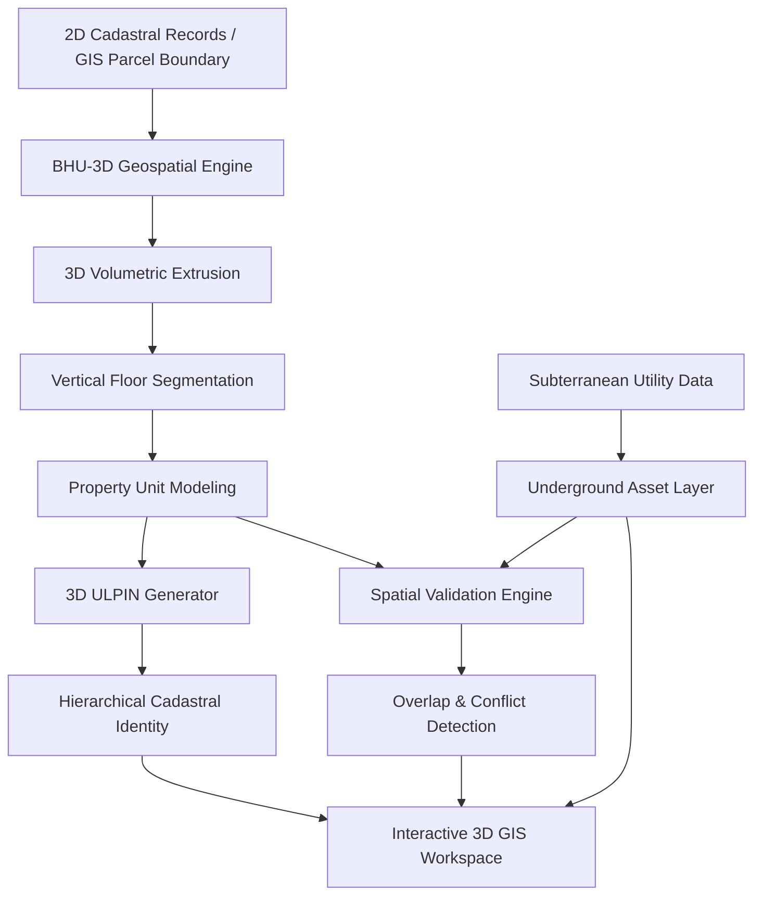

# BHU-3D — 3D ULPIN Generation & Vertical Property Mapping System

A visual 3D geospatial land administration platform that converts traditional 2D land parcels into navigable 3D property models with vertical unit identity, underground asset mapping, and spatial topology validation.

Developed as a prototype for the **Smart India Hackathon (SIH)**.

---

## 📌 Problem Statement

Traditional cadastral systems map land parcels strictly on a two-dimensional plane (latitude and longitude). While 2D Unique Land Parcel Identification Numbers (**ULPIN**) effectively identify surface plots, modern urban developments create vertical property rights stacked on top of each other:

- **Multi-Storey Vertical Ownership**: High-rise residential apartments and commercial towers house dozens of individual owners over a single ground parcel footprint.
- **Subterranean & Multi-level Infrastructure**: Basements, underground parking, utility corridors (water, gas, electrical, sewage, telecom), and transit conduits coexist below ground level without 3D spatial boundaries.
- **Ambiguity & Conflicts**: Without elevation (Z-axis) boundaries, traditional land registries cannot formally differentiate ownership volumes, leading to property disputes, tax assessment ambiguities, and encroachment issues.

---

## 💡 Proposed Solution

**BHU-3D** bridges the gap between 2D land records and modern vertical real estate by creating a digital twin of parcels with vertical and subterranean volumetric identity:

```
2D Parcel  ➔  Building Volume  ➔  Floor Segmentation  ➔  3D Property Volumes  ➔  3D ULPIN  ➔  Spatial Validation
```

1. **2D to 3D Extrusion**: Transform surface parcel polygons into georeferenced volumetric building models.
2. **Vertical Floor & Unit Segmentation**: Slice multi-storey structures into discrete spatial property volumes (apartments, retail units, common areas).
3. **Proposed 3D ULPIN Extension**: Generate unique, hierarchical spatial identifiers incorporating state, district, parcel, elevation range ($Z_{\text{min}}$ to $Z_{\text{max}}$), and unit coordinates.
4. **Underground Asset Layering**: Map utility corridors and subterranean easements to avoid infrastructure collisions.
5. **Spatial Topology & Overlap Validation**: Automated geometric validation detecting volume overlaps, cantilever encroachments, and boundary violations.

---

## ✨ Key Features

- **Interactive 3D GIS Workspace**
  - Built with Three.js and React Three Fiber.
  - Realistic GIS surface grid with parcel boundaries, coordinate displays, and camera orbit controls.
  - Layer toggles for terrain, surface parcels, 3D building models, floor volumes, and underground utilities.

- **Vertical Unit & Floor Explosion**
  - Click-to-inspect floor volumes and individual residential/commercial units.
  - Vertical separation / floor explosion mode for clear cross-sectional analysis.
  - Real-time unit metrics: floor elevation ($Z$), carpet area, ceiling height, and ownership status.

- **3D ULPIN Generator**
  - Generates verifiable hierarchical 3D property identifiers.
  - Formatted breakdown detailing:
    - State & District codes
    - Cadastral Parcel ID
    - Vertical Band / Floor Level
    - Unit ID and volumetric hash

- **Underground Utility Mapping**
  - Visualizes subterranean infrastructure layers (water supply, sewage pipelines, power lines, fiber optics).
  - Clear separation between surface property and subterranean easements.

- **Spatial Validation & Conflict Modal**
  - Real-time detection of spatial anomalies (e.g., unit boundary overlaps, unauthorized cantilever projections).
  - Severity status, affected unit identification, and proposed remediation steps.

- **Cadastral Overview Dashboard**
  - High-density monitoring screen presenting total parcels, 3D structures, vertical units, and validation stats.
  - Recent spatial activity logs tracking automated segmentation and ULPIN assignments.

---

## 🛠️ Technology Stack

| Layer                    | Technology                                                                     |
| ------------------------ | ------------------------------------------------------------------------------ |
| **Core Framework**       | React 19, TypeScript, TanStack Start                                           |
| **Routing**              | TanStack Router (file-based routing)                                           |
| **3D GIS Visualization** | Three.js, React Three Fiber (`@react-three/fiber`), Drei (`@react-three/drei`) |
| **Styling & Theme**      | Tailwind CSS v4, High-density dark GIS interface                               |
| **UI Components**        | Radix UI primitives, Lucide React icons                                        |
| **Data Visualization**   | Recharts (cadastral analytics & distributions)                                 |
| **Build & Tooling**      | Vite 8, Nitro (server bundle)                                                  |

---

## 🏛️ Architecture



---

## 📁 Project Structure

```
geo-identity-stack/
├── public/                     # Static assets & GIS favicon
├── src/
│   ├── components/
│   │   ├── bhu/                # BHU-3D workspace, panels, controls, and modals
│   │   │   ├── CameraControls.tsx
│   │   │   ├── ConflictModal.tsx
│   │   │   ├── ExtractionOverlay.tsx
│   │   │   ├── LayerControl.tsx
│   │   │   ├── Overview.tsx
│   │   │   ├── PropertyPanel.tsx
│   │   │   ├── SearchPanel.tsx
│   │   │   ├── SectionView.tsx
│   │   │   ├── Sidebar.tsx
│   │   │   ├── TopBar.tsx
│   │   │   ├── ValidationPanel.tsx
│   │   │   └── Workspace.tsx
│   │   ├── gis/                # 3D Three.js scene components
│   │   │   ├── Building3D.tsx
│   │   │   ├── GISViewer.tsx
│   │   │   ├── Ground.tsx
│   │   │   └── UndergroundLayer.tsx
│   │   └── ui/                 # Reusable UI component library (Radix primitives)
│   ├── data/                   # Demonstration dataset & spatial TypeScript types
│   │   ├── demo.ts
│   │   └── types.ts
│   ├── hooks/                  # UI and responsive helper hooks
│   ├── lib/                    # Spatial utilities, palettes, error wrappers
│   ├── routes/                 # File-based routes (TanStack Start)
│   │   ├── __root.tsx          # Root layout shell & HTML head metadata
│   │   ├── index.tsx           # Landing page & pipeline overview
│   │   └── app.tsx             # Interactive 3D GIS workspace
│   ├── state/                  # BHU-3D application context & layer state
│   ├── styles.css              # Global styling tokens & custom animations
│   ├── router.tsx              # Router initialization
│   ├── server.ts               # Server entry point
│   └── start.ts                # TanStack Start configuration
├── package.json
├── tsconfig.json
└── vite.config.ts
```

---

## 🚀 Getting Started

### Prerequisites

- **Node.js** (v18.0 or later, v20+ recommended)
- **pnpm** (recommended) or **npm**

### Installation

1. Clone the repository:

   ```bash
   git clone <repository-url>
   cd geo-identity-stack
   ```

2. Install dependencies:

   ```bash
   pnpm install
   # or
   npm install
   ```

3. Start the local development server:

   ```bash
   pnpm run dev
   # or
   npm run dev
   ```

4. Open [http://localhost:3000](http://localhost:3000) (or the port displayed in your terminal) to view the application.

### Building for Production

To create an optimized production build:

```bash
pnpm run build
# or
npm run build
```

To preview the production build locally:

```bash
pnpm run preview
# or
npm run preview
```

---

## 📝 Demo Notes

- This prototype utilizes synthetic demonstration data based on urban cadastral layouts in Lucknow, Uttar Pradesh (`UP-LKO-P123456`).
- The 3D identifier displayed is a proposed extension format for vertical property mapping and volumetric land records.

---

## 📄 License

This project is licensed under the MIT License — feel free to use and adapt for hackathon and research presentations.
